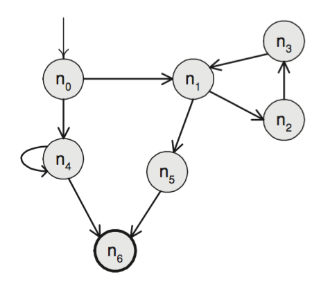
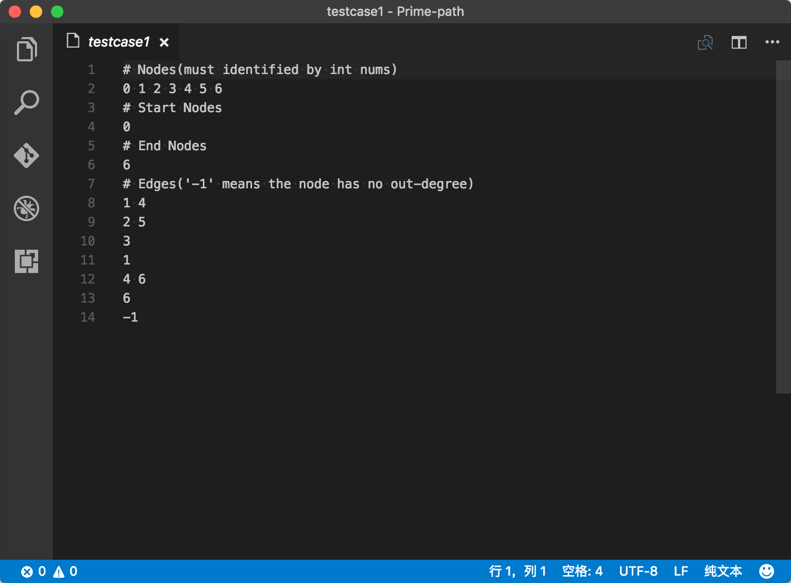
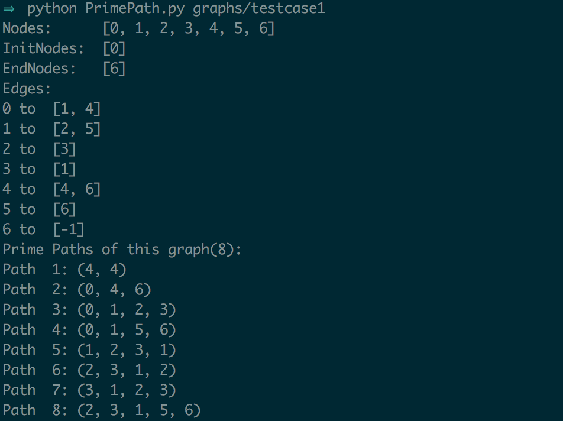

# Finding The Prime Paths

## Introduction

According to Prime path coverage criterion, this program will generate all the prime paths of graph whose structure is exactly defined by given text file. 

>  NOTE: The program is implemented by python2.7 and all the resource files are **encoded by utf-8**.

## Define a Graph

The structure of the graph must be exactly defined. For example, as the structure shown in the below picture:

 **The format of definition file format must be as shown below picture:**

### File Format

1. **The 1st, 3rd, 5th and 7th lines are comment line, which cannot be removed.** 

2. The nodes of graph are specified in 2nd line, all the nodes' identifier must be nonnegative integer.

3. The 4th line specified the start node of the graph.

4. The 6th line specified the end node of the graph.

5. Starting from line 8, all edges of the graph are defined **in the order in which starting nodes are defined in '# Nodes' before**, each line contains the target node of the edges. 

   For example, there are two edges starting from node $n_0$, which are '$n_0 \rightarrow n_1$' and '$n_0 \rightarrow n_4$'. So in the 8th line, there are two integers 1 and 4.

6. '-1' mean the node is end node of the graph, **it is just a placeholder**.

## Usage

You can see the help info without given graph file:

Run `PrimePath.py` by given graph structure file, program will generate the prime paths. Using the above mentioned graph: 

